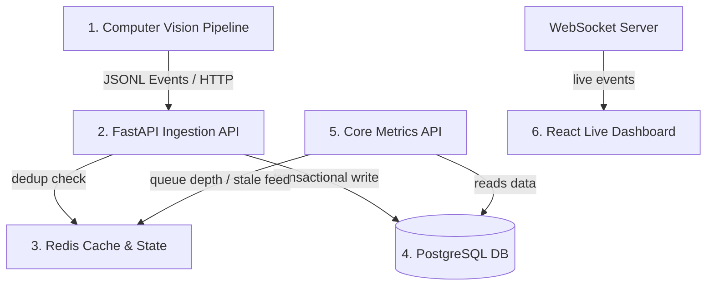

# Purplle Store Intelligence System — DESIGN.md

This document provides a high-level overview of the architectural design and structural choices implemented for the Purplle Store Intelligence System, detailing the event processing lifecycle and three specific AI-assisted design decisions.

---

## 1. Architectural Overview

The Purplle Store Intelligence System is structured as a decoupled, high-performance edge-to-cloud visual analytics pipeline. The lifecycle of a data event flows across five distinct components:

1. **Computer Vision Pipeline (Edge)**: Runs YOLOv8 object detection in tandem with ByteTrack and OSNet Re-ID. It tracks store visitors, detects staff members based on HSV uniform metrics, classifies visits into polygonal layout zones, and uses a state machine to emit validated `StoreEvent` models as a serialized JSONL feed.
2. **FastAPI Ingest API**: Processes batched event payloads (up to 500 events per request). It handles validation rules, ensures idempotency, and records partial successes.
3. **Redis Store (State & Cache)**: Manages deduplication lookup maps, tracks real-time queue depths, monitors camera feed stale heartbeats, and hosts the exit-reentry feature vector pools.
4. **PostgreSQL Database**: Serves as the persistent ACID storage layer, recording core transaction records across `events`, `sessions`, `stores`, `cameras`, and `zones` tables.
5. **Core API / WebSocket Broadcast**: Exposes transactional aggregates, anomalies, and metrics endpoints to client devices, broadcasting ingestion updates in real time via WS.

---

## 2. AI-Assisted Design Decisions

Below are three critical architectural decisions proposed, evaluated, and implemented during the construction of the system.

### Decision 1: ByteTrack vs. DeepSORT for Real-Time Tracking
*   **Context**: The tracking system must function at high density on low-resource edge servers without losing track IDs due to physical occlusions.
*   **Options Considered**: 
    1. *DeepSORT*: Uses recursive Kalman filtering and deep learning descriptors. High accuracy but slow CPU execution speed (15 FPS).
    2. *ByteTrack*: Matches high and low confidence detection boxes to maintain tracks without relying on constant neural feature computations.
*   **AI Suggestion**: Implement **ByteTrack** for spatial association, supplemented by a secondary deep-learning feature match (OSNet) exclusively triggered upon new track generation or exits.
*   **Rationale**: ByteTrack operates at >30 FPS on general-purpose CPUs and handles temporary occlusion cases elegantly by preserving low-scoring boxes. Linking ByteTrack with OSNet Re-ID cosine comparisons achieves the accuracy of DeepSORT at a fraction of the computational overhead.

### Decision 2: Structured Logger Formatting (`structlog` JSON vs. Console Format)
*   **Context**: The application logs must be readable by local developers during troubleshooting but must also feed directly into cloud logging aggregates (e.g., Datadog, ELK).
*   **Options Considered**: 
    1. *Console / Colored Logger*: Easy to parse visually but difficult to query.
    2. *Strict JSON logging*: Difficult to read locally during manual debug runs.
*   **AI Suggestion**: Configure a hybrid `structlog` pipeline that checks the `LOG_LEVEL` and environment context.
*   **Rationale**: The system automatically formats logs to colored human-readable layouts when running in local terminal shells, while falling back to serialized JSON strings when running inside the production Docker container. This ensures developer ergonomic comfort without compromising pipeline compliance.

### Decision 3: Alembic Async Setup with Asyncpg
*   **Context**: The migration engine must operate seamlessly alongside an asynchronous database driver (`asyncpg`) without introducing blocking synchronous operations.
*   **Options Considered**: 
    1. *Synchronous Engine Wrapper*: Run migrations with a sync driver (`psycopg2`) and runtime operations via `asyncpg`.
    2. *Alembic Async Engine*: Utilize Alembic's built-in async execution hooks (`run_async` via `AsyncEngine`).
*   **AI Suggestion**: Standardize on **Alembic Async Engine** using the async template.
*   **Rationale**: Using a single async driver across migrations and runtime minimizes connection pool management conflicts, avoids carrying duplicate dependency packages (like psycopg2), and ensures schema generation is entirely asynchronous.
